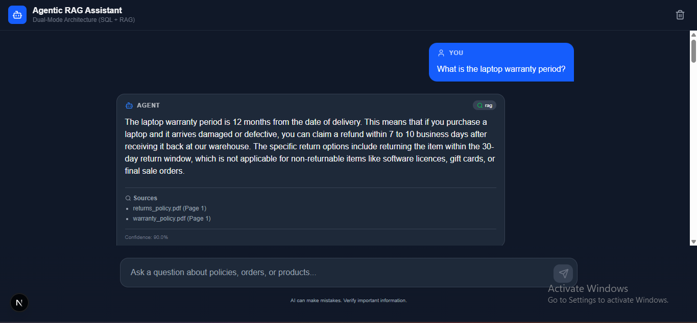
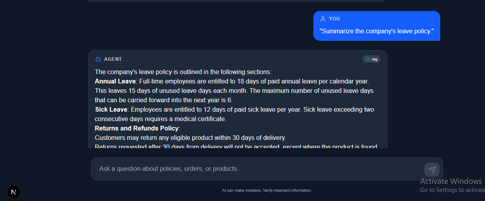
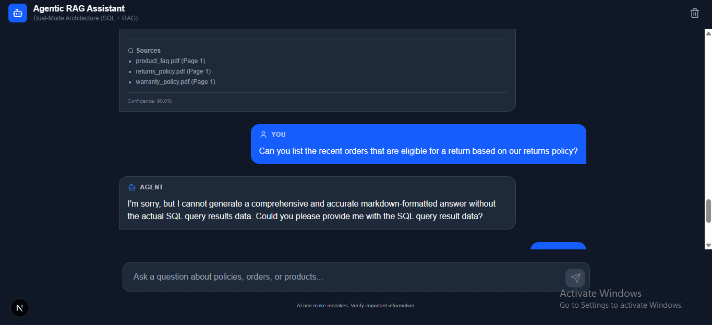
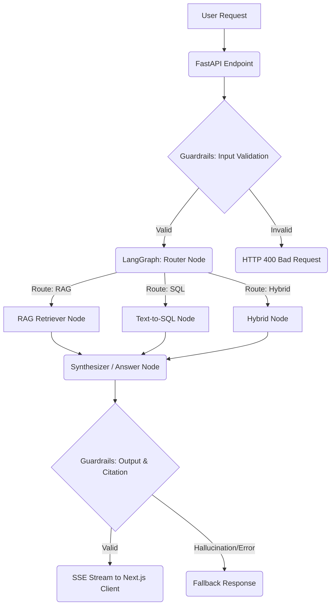

# 🚀 Dual-Mode Agentic RAG Chatbot


A production-grade, dual-mode enterprise AI assistant that intelligently routes user queries between a Vector-based Retrieval-Augmented Generation (RAG) pipeline for unstructured documents, a Text-to-SQL engine for structured relational data, or a hybrid combination of both.

---

## 📸 Screenshots


| RAG Response (Warranty) | RAG Response (Leave Policy) | Hybrid Response (Returns) |
|----------------|--------------|-----------------|
|  |  |  |

---

## ✨ Enterprise Features

- **🧠 Agentic Routing:** Automatically classifies intent to decide whether to query PDFs, the SQLite database, or both simultaneously.
- **🔍 Hybrid RAG & Cross-Encoder Reranking:** BM25 keyword search + semantic vector search, combined via Reciprocal Rank Fusion (RRF), and re-ranked for maximum precision.
- **📊 Text-to-SQL Engine:** Generates secure read-only SQL queries to answer analytical questions from an existing SQLite database.
- **⚡ LangGraph Orchestration:** A robust state-machine defining the AI workflow, ensuring reliability and deterministic execution.
- **🛡️ Enterprise Guardrails:** Hardened against prompt injection, jailbreaks, hallucinations, and SQL injection. Output validation ensures no internal stack traces leak to the user.
- **🌊 SSE Streaming Interface:** Renders ChatGPT-style tokens instantly, providing a seamless Next.js frontend experience.
- **🧠 Conversational Memory:** Backed by Redis to retain contextual history per-session.
- **📈 Observability:** Prometheus metrics, structured JSON logging, and API health checks (`/live`, `/ready`, `/startup`).

---

## 🏗️ System Architecture



---

## 🧪 Testing the Application

For a comprehensive list of test queries for RAG, SQL, and Hybrid routing, please see the [Testing Guide](./TESTING_GUIDE.md).

---

## 🚀 Local Setup

### 1. Requirements
- Docker & Docker Compose (Recommended)
- Python 3.11+ (If running natively on Windows/Mac)
- Node.js 20+ (Required for the Next.js Frontend)

### 2. Environment Variables
Copy the template and fill in your keys (e.g., `GROQ_API_KEY`).
```bash
cp .env.example .env
```

### 3. Option A: Running with Docker Compose (Recommended)
This command spins up FastAPI, Redis, Ollama, Prometheus, Grafana, and Nginx in isolated containers.
```bash
./start_docker.sh
```

### 4. Option B: Running Natively (Without Docker)
If you are low on disk space (`ENOSPC`) or your Docker Engine fails to start, you can run the services natively. 
*Note: Ensure `ENABLE_MEMORY=False` in `.env` if you do not have Redis installed locally.*

**Start the Backend:**
```powershell
python -m venv .venv
.\.venv\Scripts\Activate.ps1
pip install -r backend/requirements.txt
uvicorn backend.main:app --host 0.0.0.0 --port 8000
```

**Start the Frontend:**
Open a separate terminal window:
```powershell
cd frontend
npm install
npm run dev --webpack
```
Access the UI at `http://localhost:3000`.

---

## 🌍 Public Deployment Guide

To deploy this project to the public internet:

### Backend (Render / Railway / Fly.io)
1. Link your GitHub repository to your PaaS provider.
2. Select **Dockerfile** as the build mechanism.
3. Configure Environment Variables matching `.env.example` in the PaaS dashboard.
4. Ensure `APP_ENV=production` to enable strict CORS and disable debug traces.
5. Set up a managed **Redis** instance (e.g., Upstash) and supply the `REDIS_URL`.
6. For LLMs, provide the `GROQ_API_KEY` and enable `ENABLE_FALLBACK_MODEL=True` since hosting local GPU Ollama models on PaaS can be expensive.

### Frontend (Vercel)
1. Import the repository into **Vercel**.
2. Set the "Root Directory" to `frontend`.
3. Set the Framework Preset to Next.js.
4. Add the Environment Variable: `NEXT_PUBLIC_API_URL=https://<YOUR_BACKEND_URL>`
5. Click **Deploy**.

---

## ⚠️ Known Limitations
- **SQLite Bottlenecks**: The `orders.db` is an SQLite database. It is highly capable for demonstration, but not built for concurrent multi-writer enterprise loads.
- **Ollama Hardware Constraints**: Running the LLM strictly on-premise requires significant local GPU (VRAM) resources.

## 🔮 Future Improvements
1. **PostgreSQL Migration**: Swap SQLite for a fully managed PostgreSQL instance.
2. **User Authentication**: Introduce JWT authentication or OAuth2 (NextAuth) for personalized user accounts and tenant data isolation.
3. **Semantic Caching**: Add a Redis semantic caching layer to bypass the LLM for repeated identical queries.
